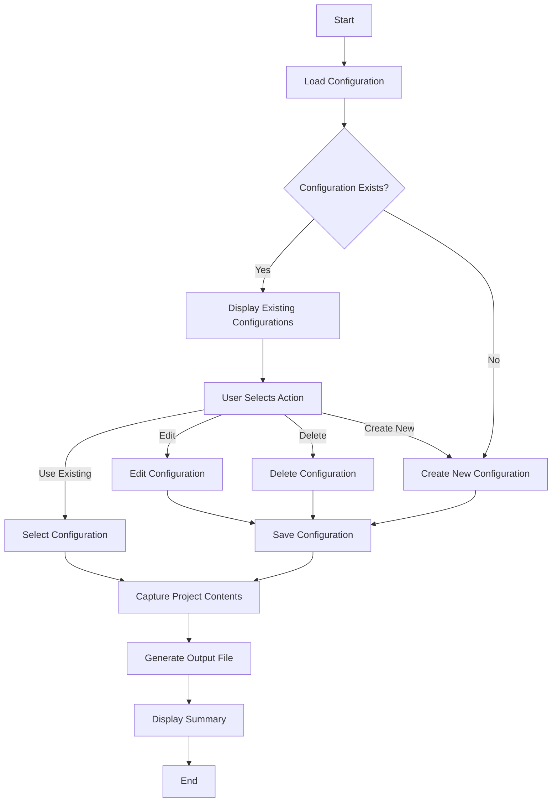
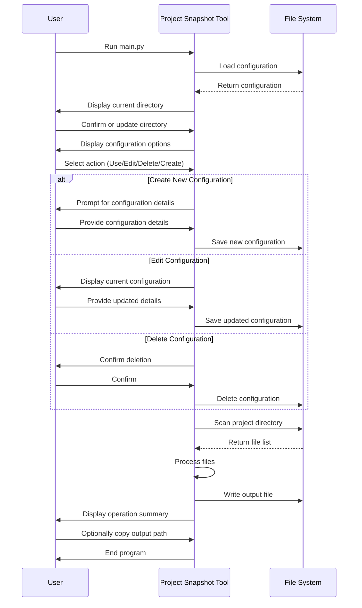

# Project Snapshot: AI-Ready Project Capture Tool

Project Snapshot is a powerful and user-friendly tool designed to capture the essence of your project for AI-assisted development. By providing a comprehensive snapshot of your project structure and contents, it enables AI language models to have full context, resulting in more accurate and helpful responses.

## Features

- 🧠 AI-Ready: Captures project contents in a format optimized for AI/LLM consumption
- 🎨 Modern CLI: Intuitive and visually appealing command-line interface
- 📁 Smart Filtering: Honors `.gitignore` patterns and excludes common build artifacts
- 🌳 Directory Tree: Generates a clear visual representation of your project structure
- 📄 File Contents: Captures the contents of all relevant project files
- 🔧 Configurable: Easily customizable output and project names
- 💾 Persistent Configuration: Saves your preferences for future use
- 🚀 Performance: Efficiently handles large projects with memory mapping for big files
- 🔍 Detailed Logging: Comprehensive logging for troubleshooting and auditing

## Installation

1. Clone the repository:

   ```sh
   git clone <repository_url>
   cd project-snapshot
   ```

2. Create and activate a virtual environment:

   ```sh
   python3 -m venv venv
   source venv/bin/activate   # On Windows, use `venv\Scripts\activate`
   ```

3. Install the required dependencies:

   ```sh
   pip install -r requirements.txt
   ```

## Usage

Run the script to generate the project snapshot:

```sh
python main.py
```

Follow the intuitive prompts to:

- Set or update the target directory
- Choose an existing configuration or create a new one
- Customize the project name and output filename
- Choose whether to include the project content in the AI prompt

The tool will guide you through the process and provide a summary of the operation upon completion.

## Project Workflow

The following diagram illustrates the high-level workflow of the Project Snapshot tool:



This workflow demonstrates the main steps of the tool, from loading the configuration to generating the final output file.

## User Interaction Sequence

The following sequence diagram illustrates the interaction between the user and the Project Snapshot tool:



This sequence diagram shows the back-and-forth interaction between the user, the tool, and the file system throughout the project snapshot process.

## Output

The generated snapshot will be saved in the `output/` directory, organized by project name. Each snapshot file includes:

- A directory tree of your project
- Contents of all relevant files
- Optional wrapping in an AI-ready prompt format

## Configuration

The tool uses a `config.json` file to store your preferences and project configurations. This file is created automatically when you run the tool for the first time and is updated as you make choices. You don't need to edit this file manually.

## Logging

Detailed logs are saved in the `project_snapshot.log` file. Check this file for more information if you encounter any issues or want to review the tool's operation in detail.

## Contributing

Contributions are welcome! Please feel free to submit a Pull Request.

## Testing

To run the unit tests, use the following command:

```sh
python -m unittest test_snapshot.py
```

## License

This project is licensed under the MIT License.
