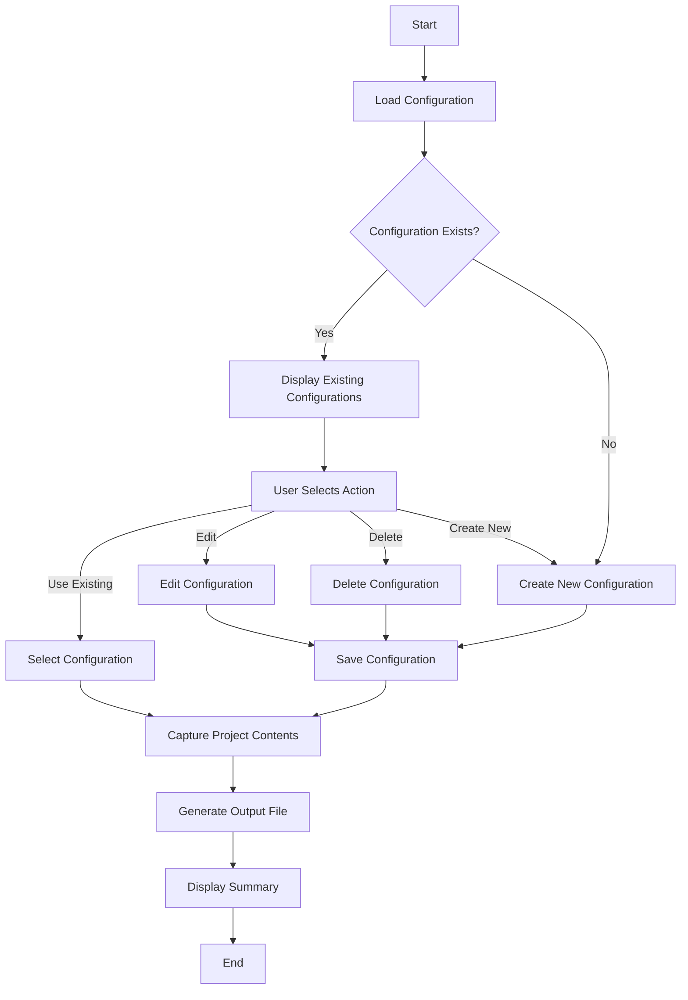
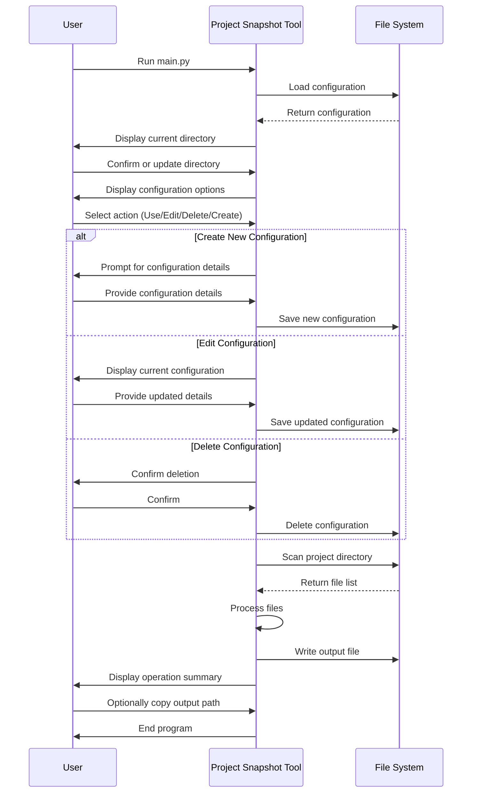

# Project Snapshot: AI-Ready Project Capture Tool

Project Snapshot is a powerful and user-friendly tool designed to capture the essence of your project for AI-assisted development. By providing a comprehensive snapshot of your project structure and contents, it enables AI language models to have full context, resulting in more accurate and helpful responses.

## Features

- 🧠 AI-Ready: Captures project contents in a format optimized for AI/LLM consumption
- 🎨 Modern UI: Intuitive and visually appealing web interface using Streamlit
- 📁 Smart Filtering: Granular control over `.gitignore` patterns and custom ignore rules:
  - Use local and/or project `.gitignore` files
  - Import patterns from existing files
  - Define custom ignore patterns
  - Configure per project
  - Predefined templates for common project types (Python, Node.js, Java)
- 🌳 Directory Tree: Generates a clear visual representation of your project structure
- 📄 File Contents: Captures the contents of all relevant project files
- 🔧 Configurable: Easily customizable output and project names
- 💾 Persistent Configuration: Saves your preferences for future use
- 🚀 Performance: 
  - Parallel processing for significantly faster snapshots
  - Memory mapping for efficient handling of large files
  - Smart binary file detection through both extension and content analysis
- 🔍 Detailed Logging: Comprehensive logging for troubleshooting and auditing

## What's New

Recent improvements to Project Snapshot have significantly enhanced its performance and usability:

- **Parallel Processing**: The snapshot engine now processes files concurrently, providing up to 5-10x faster performance on multi-core systems.
- **Enhanced Binary Detection**: Improved algorithm that checks both file extensions and content for more accurate binary file detection.
- **Centralized Configuration**: New architecture with clear separation between core functionality and user interfaces.
- **Expanded Language Support**: Support for over 50 programming languages with proper syntax highlighting.
- **Template System**: Predefined ignore pattern templates for common project types (Python, Node.js, Java, etc.)
- **Improved Error Handling**: More robust error recovery and detailed reporting.
- **Type Safety**: Comprehensive type hints throughout the codebase for better reliability.

## Installation

### Quick Setup (Recommended)

Use the provided setup script for a complete development environment:

```sh
git clone <repository_url>
cd project-capture
./setup.sh
```

This will:
- Create a virtual environment
- Install all dependencies
- Set up pre-commit hooks
- Create necessary directories

### Manual Installation

1. Clone the repository:

   ```sh
   git clone <repository_url>
   cd project-capture
   ```

2. Create and activate a virtual environment:

   ```sh
   python3 -m venv venv
   source venv/bin/activate   # On Windows, use `venv\Scripts\activate`
   ```

3. Install the package in development mode:

   ```sh
   pip install -e ".[dev]"
   ```

## Usage

### CLI Interface

Run the command-line interface:

```sh
./project_capture
# or
python -m project_capture.cli
```

### Streamlit Web Interface

Run the Streamlit app to use the web interface:

```sh
streamlit run src/project_capture/web/app.py
# or
make run-web
```

Follow the intuitive prompts to:

- Set or update the target directory
- Choose an existing configuration or create a new one
- Customize the project name and output filename
- Choose whether to include the project content in the AI prompt

The tool will guide you through the process and provide a summary of the operation upon completion.

## Project Workflow

The following diagram illustrates the high-level workflow of the Project Snapshot tool:


```mermaid
graph TD
    A[Start] --> B[Load Configuration]
    B --> C{Configuration Exists?}
    C -->|Yes| D[Display Existing Configurations]
    C -->|No| E[Create New Configuration]
    D --> F[User Selects Action]
    E --> G[Save Configuration]
    F -->|Use Existing| H[Select Configuration]
    F -->|Edit| I[Edit Configuration]
    F -->|Delete| J[Delete Configuration]
    F -->|Create New| E
    I --> G
    J --> G
    H --> K[Capture Project Contents]
    G --> K
    K --> L[Generate Output File]
    L --> M[Display Summary]
    M --> N[End]
```

This workflow demonstrates the main steps of the tool, from loading the configuration to generating the final output file.

## User Interaction Sequence

The following sequence diagram illustrates the interaction between the user and the Project Snapshot tool:


```mermaid
sequenceDiagram
    participant User
    participant Tool as Project Snapshot Tool
    participant FileSystem as File System

    User->>Tool: Run main.py
    Tool->>FileSystem: Load configuration
    FileSystem-->>Tool: Return configuration
    Tool->>User: Display current directory
    User->>Tool: Confirm or update directory
    Tool->>User: Display configuration options
    User->>Tool: Select action (Use/Edit/Delete/Create)
    alt Create New Configuration
        Tool->>User: Prompt for configuration details
        User->>Tool: Provide configuration details
        Tool->>FileSystem: Save new configuration
    else Edit Configuration
        Tool->>User: Display current configuration
        User->>Tool: Provide updated details
        Tool->>FileSystem: Save updated configuration
    else Delete Configuration
        Tool->>User: Confirm deletion
        User->>Tool: Confirm
        Tool->>FileSystem: Delete configuration
    end
    Tool->>FileSystem: Scan project directory
    FileSystem-->>Tool: Return file list
    Tool->>Tool: Process files
    Tool->>FileSystem: Write output file
    Tool->>User: Display operation summary
    User->>Tool: Optionally copy output path
    Tool->>User: End program
```

This sequence diagram shows the back-and-forth interaction between the user, the tool, and the file system throughout the project snapshot process.

## Output

The generated snapshot will be saved in the `output/` directory, organized by project name. Each snapshot file includes:

- A directory tree of your project
- Contents of all relevant files
- Optional wrapping in an AI-ready prompt format

## Configuration

The tool uses a `config.json` file to store your preferences and project configurations. This file is created automatically when you run the tool for the first time and is updated as you make choices. Each project configuration can include:

- Project name and output pattern
- AI prompt inclusion setting
- Gitignore settings (local and project)
- Custom ignore patterns
- Last used timestamp

### Configuration Files

- `config.json.example` - Example configuration file
- `examples/.gitignore.example` - Common gitignore patterns

Copy the example configuration and customize as needed:

```sh
cp config.json.example config.json
```

## Ignore Pattern Management

The tool provides flexible ways to control which files are included in your snapshots:

1. Gitignore Integration:
   - Automatically respects local `.gitignore` (from current directory)
   - Automatically respects project `.gitignore` (from target directory)
   - Each can be enabled/disabled per configuration

2. Custom Patterns:
   - Import patterns from existing files (`.gitignore`, `.npmignore`, etc.)
   - Add/remove patterns directly in the interface
   - Uses standard `.gitignore` syntax

3. Pattern Syntax Examples:
   - `*.log` - Ignore all log files
   - `build/` - Ignore the build directory
   - `test_*.py` - Ignore test files
   - `docs/*.md` - Ignore markdown files in docs directory
   - `!README.md` - Don't ignore README.md (exception)

These patterns work together to give you precise control over your project snapshots.

## Logging

Detailed logs are saved in the `project_snapshot.log` file. Check this file for more information if you encounter any issues or want to review the tool's operation in detail.

## Contributing

Contributions are welcome! Please feel free to submit a Pull Request.

## Development

### Running Tests

```sh
# Run all tests
make test

# Run unit tests only
make test-unit

# Run integration tests only
make test-integration

# Run with coverage report
pytest --cov=project_capture
```

### Code Quality

```sh
# Run all checks
make check-all

# Run linting
make lint

# Format code
make format

# Type checking
make type-check

# Security scan
make security
```

### Development Workflow

1. Create a feature branch
2. Make your changes
3. Run `make check-all` to ensure quality
4. Submit a pull request

See [CONTRIBUTING.md](CONTRIBUTING.md) for detailed guidelines.

## License

This project is licensed under the MIT License.
